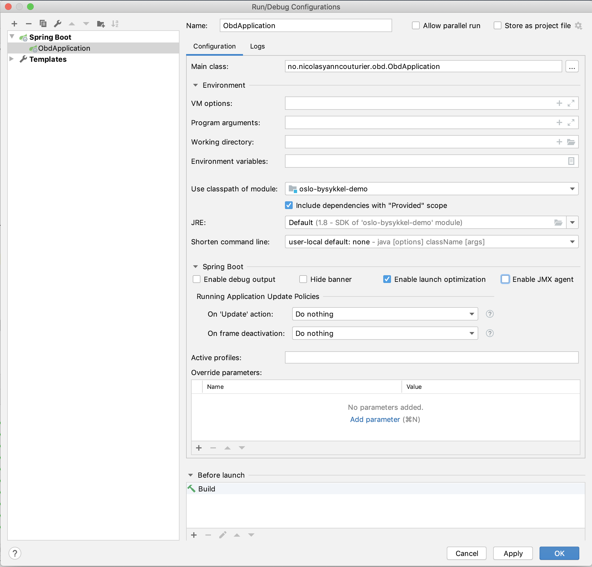

# Oslo Bysykkel Demo

A small demo app listing availability statuses of bikes and docks on the stations in Oslo.

# Prerequistes

- Java 8
- Maven

# Running the app

## IntelliJ Idea

The IDE should configure a Spring Boot run configuration automatically upon import of the project.

Otherwise, create a Spring Boot run configuration and configure it like the following:


Click the run icon and go to http://localhost:8080

## Command line

Either build and run the artifact
```
mvn clean package && java -jar target/oslo-bysykkel-demo-0.0.1-SNAPSHOT.jar
```
Or run the Spring Boot plugin directly
```
mvn spring-boot:run
```

Finally, go to http://localhost:8080

## Offline mode

It is possible to run the app in offline mode so as not to issue requests to the API while developing.
Add the JVM option `-Dspring.profiles.active=offline`.

## What you should see

### iPhone

All stations:


Searched stations:


Data cannot be retrieved:


### Desktop

All stations:


Searched stations:


Data cannot be retrieved:


# Choices

## Language

I chose Kotlin for the following reasons:
- I wanted to expereiment with it and this was a good opportunity (this is my first ever Kotlin code)
- not so far from the language I use daily: Java
- null-safety nice-ities
- easy immutability
- less verbose (and required less code for the mapping of JSON to POJO)

Otherwise, I guess the fastest for me would have been to use Java+Lombok

## Tooling

Maven because it is widely adopted and the project is relatively simple and needs no special customization.

## Frameworks

Spring Boot Web because it provides much functionality out of the box (easy to expose routes, wire dependencies, provides whitelabel error pages, and so on).

OkHttp+Jackson for fetching and mapping the GBFS data for their flexibility and their ease of use.

Mustache as it is easy to use and prevents from writing code in the view / templates (as opposed to say JSP).

Material Design for Bootstrap as it provides a clean look-and-feel and all of the Bootstrap nice-ities for a quick minimal presentation layer. 