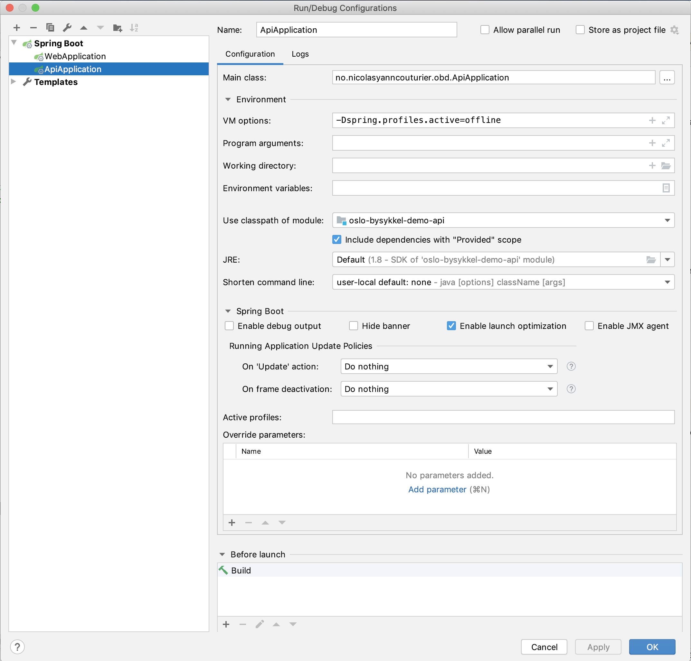
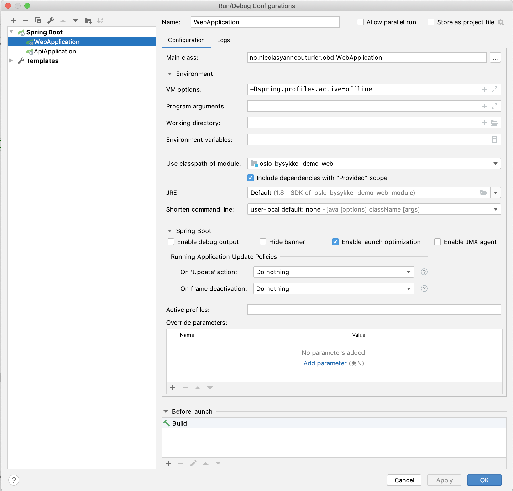
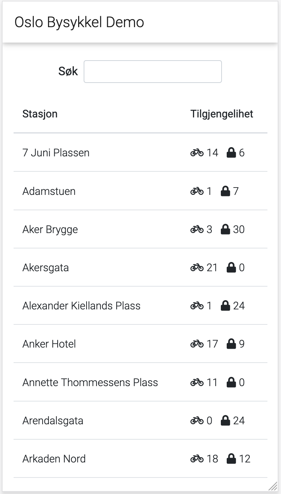
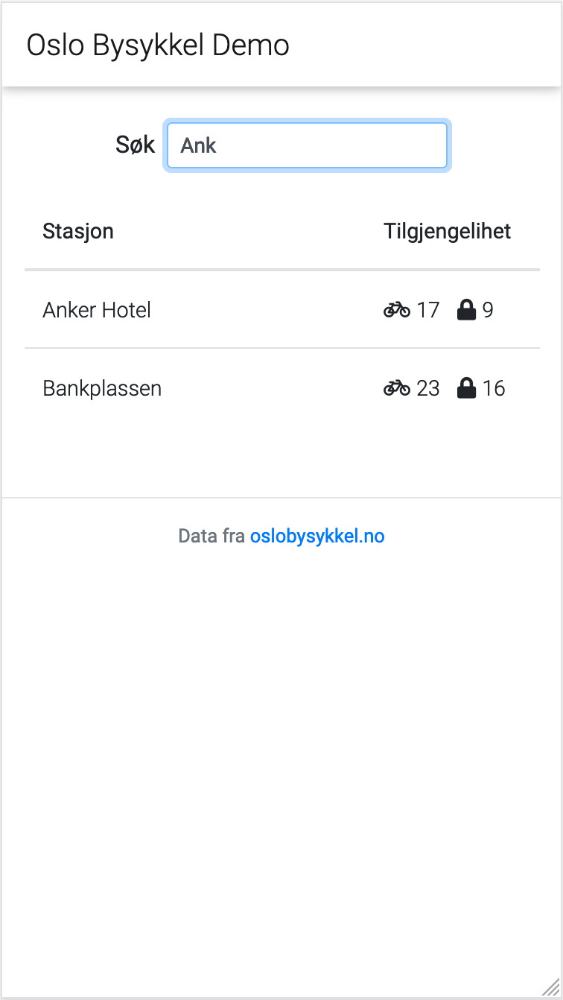
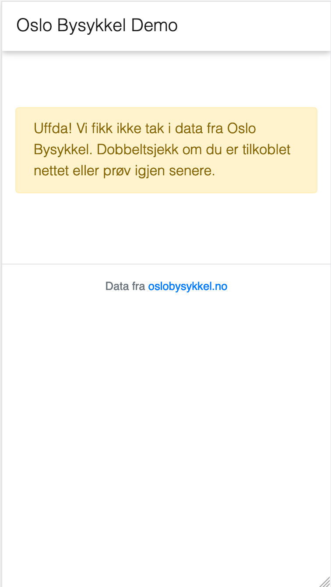
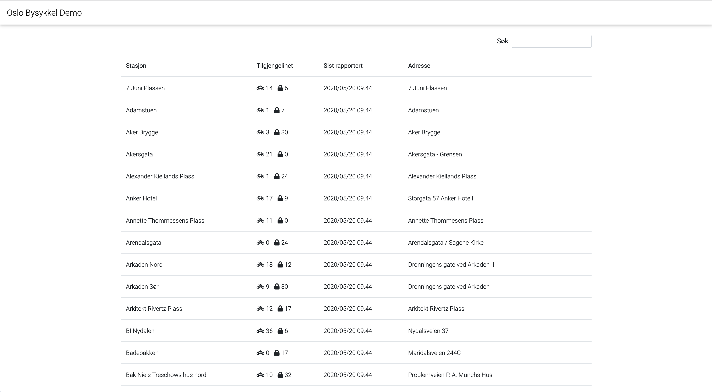
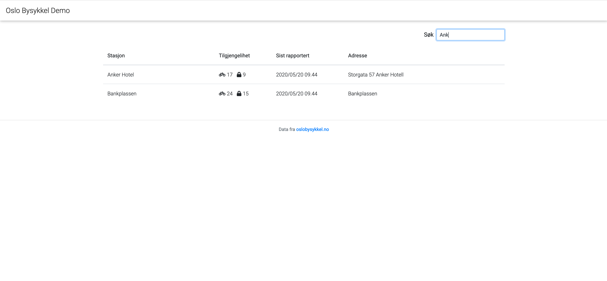
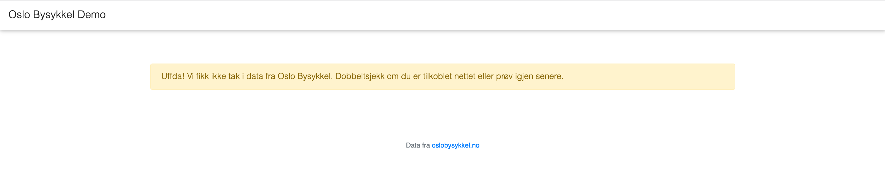

# Oslo Bysykkel Demo

A small demo app listing availability statuses of bikes and docks on the stations in Oslo.

# Prerequistes

- Java 8
- Maven

# Project structure

The project contains 3 modules:
- `web`: a minimal spring-boot web app that contains a single view rendering a list of the bike stations in Oslo and 
their availabilities
- `api`: a small HAL+JSON spring-boot HATEOAS app that contains a single endpoint to get data rendered in the webapp
- `lib`: common code between the two modules above

This allows `web` and `api` to be deployed separately as they may have different SLAs.

# Running

## Offline mode

It is possible to run the apps in offline mode so as not to issue requests to the Oslo Bysykkel API while developing.
Add the JVM option `-Dspring.profiles.active=offline`.

## api

### IntelliJ Idea

The IDE should configure a Spring Boot run configuration automatically upon import of the project.

Otherwise, create a Spring Boot run configuration and configure it like the following:


Click the run icon and use your favorite http client to query http://localhost:8081/statuses/end-user-friendly.

### Command line

Either build and run the artifact
```
cd api && mvn clean package && java -jar target/oslo-bysykkel-demo-api-0.0.1-SNAPSHOT.jar
```
Or run the Spring Boot plugin directly
```
cd api && mvn spring-boot:run
```

Finally use your favorite http client to query http://localhost:8081/statuses/end-user-friendly.

### What you should see

For example:
```curl -v http://localhost:8080/statuses/end-user-friendly | jq
     % Total    % Received % Xferd  Average Speed   Time    Time     Time  Current
                                    Dload  Upload   Total   Spent    Left  Speed
     0     0    0     0    0     0      0      0 --:--:-- --:--:-- --:--:--     0*   Trying ::1...
   * TCP_NODELAY set
   * Connected to localhost (::1) port 8080 (#0)
   > GET /statuses/end-user-friendly HTTP/1.1
   > Host: localhost:8080
   > User-Agent: curl/7.54.0
   > Accept: */*
   > 
   < HTTP/1.1 200 
   < Content-Type: application/hal+json
   < Transfer-Encoding: chunked
   < Date: Sat, 30 May 2020 11:11:06 GMT
   < 
   { [795 bytes data]
   100   788    0   788    0     0  46081      0 --:--:-- --:--:-- --:--:-- 46352
   * Connection #0 to host localhost left intact
   {
     "_embedded": {
       "statuses": [
         {
           "stationName": "7 Juni Plassen",
           "isRenting": false,
           "numBikesAvailable": 4,
           "isReturning": true,
           "numDocksAvailable": 9,
           "address": "7 Juni Plassen",
           "lastReported": 1540219230000
         },
         {
           "stationName": "Sotahjørnet",
           "isRenting": true,
           "numBikesAvailable": 4,
           "isReturning": false,
           "numDocksAvailable": 8,
           "address": "Sotahjørnet",
           "lastReported": 1540219230000
         },
         {
           "stationName": "Stasjon mangler tilg. lås",
           "isRenting": true,
           "numBikesAvailable": 4,
           "isReturning": true,
           "numDocksAvailable": null,
           "address": null,
           "lastReported": 1540219230000
         },
         {
           "stationName": "Stasjon mangler tilg. sykkel",
           "isRenting": true,
           "numBikesAvailable": null,
           "isReturning": true,
           "numDocksAvailable": 9,
           "address": null,
           "lastReported": 1540219230000
         }
       ]
     },
     "_links": {
       "self": {
         "href": "http://localhost:8080/statuses/end-user-friendly"
       }
     }
   }
```

## webapp

### IntelliJ Idea

The IDE should configure a Spring Boot run configuration automatically upon import of the project.

Otherwise, create a Spring Boot run configuration and configure it like the following:


Click the run icon and go to http://localhost:8080

### Command line

Either build and run the artifact
```
cd web && mvn clean package && java -jar target/oslo-bysykkel-demo-web-0.0.1-SNAPSHOT.jar
```
Or run the Spring Boot plugin directly
```
cd web && mvn spring-boot:run
```

Finally, go to http://localhost:8080

### What you should see

#### iPhone

All stations:



Searched stations:



Data cannot be retrieved:



#### Desktop

All stations:



Searched stations:



Data cannot be retrieved:



# Choices

## Language

I chose Kotlin for the following reasons:
- I wanted to expereiment with it and this was a good opportunity (this is my first ever Kotlin code)
- not so far from the language I use daily: Java
- null-safety nice-ities
- easy immutability
- less verbose (and required less code for the mapping of JSON to POJO)

Otherwise, I guess the fastest for me would have been to use Java+Lombok

## Tooling

Maven because it is widely adopted and the project is relatively simple and needs no special customization.

## Frameworks

Spring Boot Web because it provides much functionality out of the box (easy to expose routes, wire dependencies, provides whitelabel error pages, and so on).

OkHttp+Jackson for fetching and mapping the GBFS data for their flexibility and their ease of use.

Mustache as it is easy to use and prevents from writing code in the view / templates (as opposed to say JSP).

Material Design for Bootstrap as it provides a clean look-and-feel and all of the Bootstrap nice-ities for a quick minimal presentation layer. 